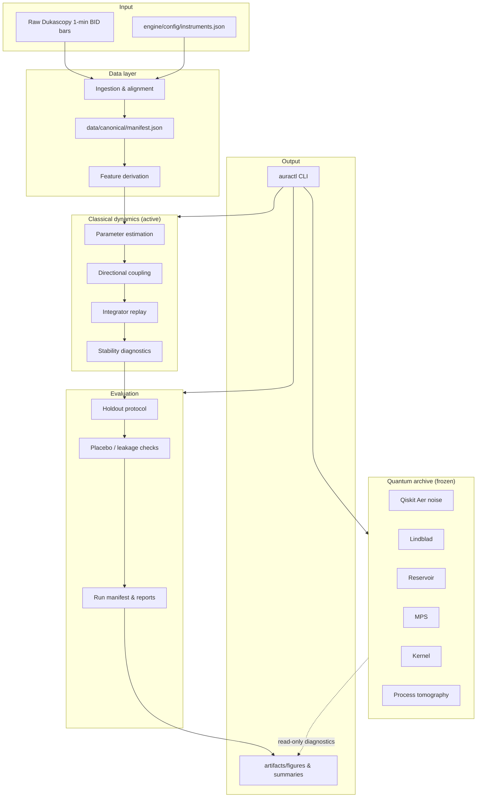
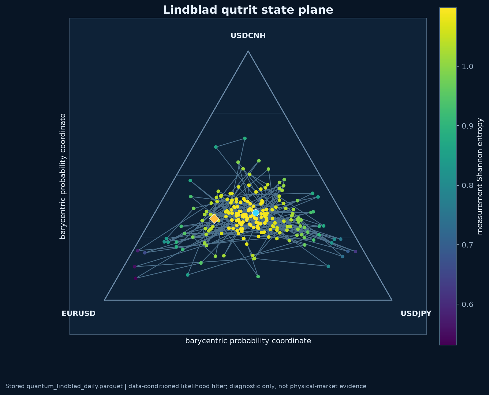
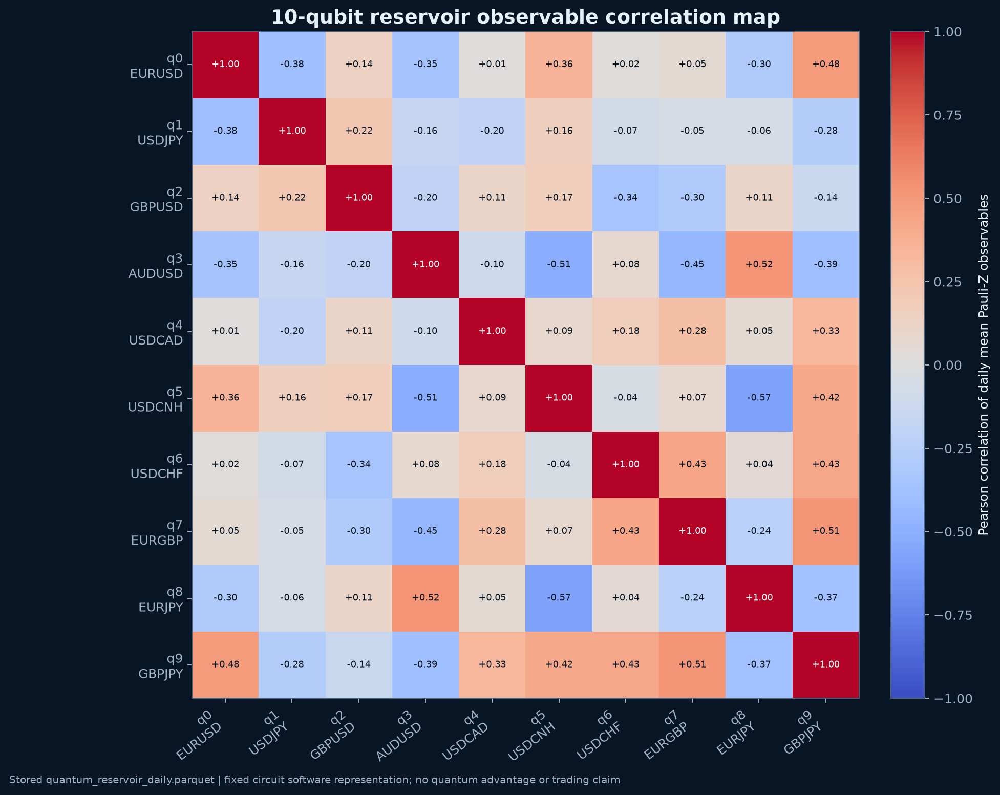
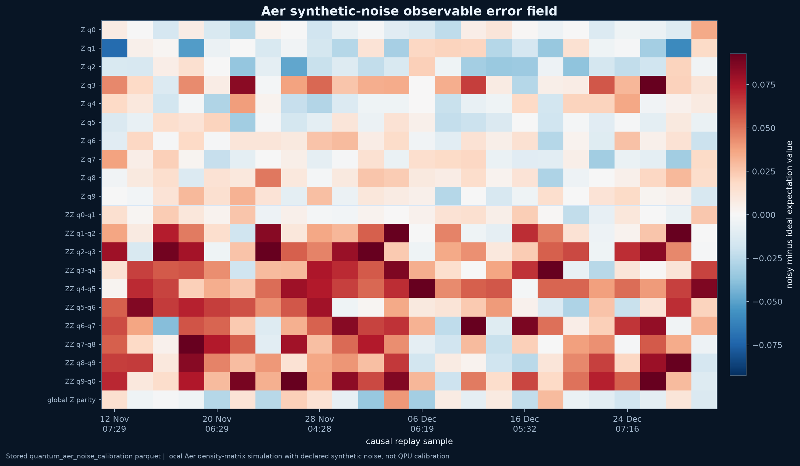
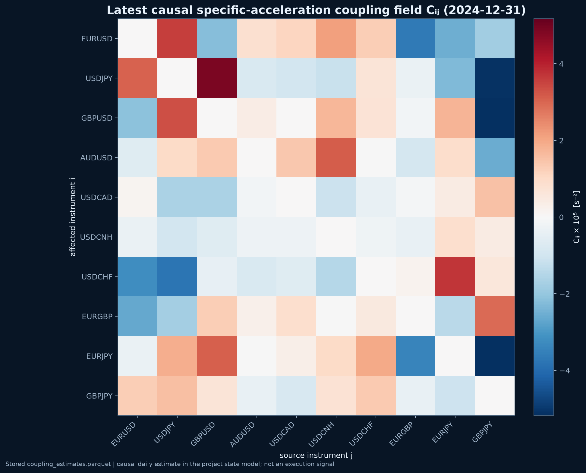
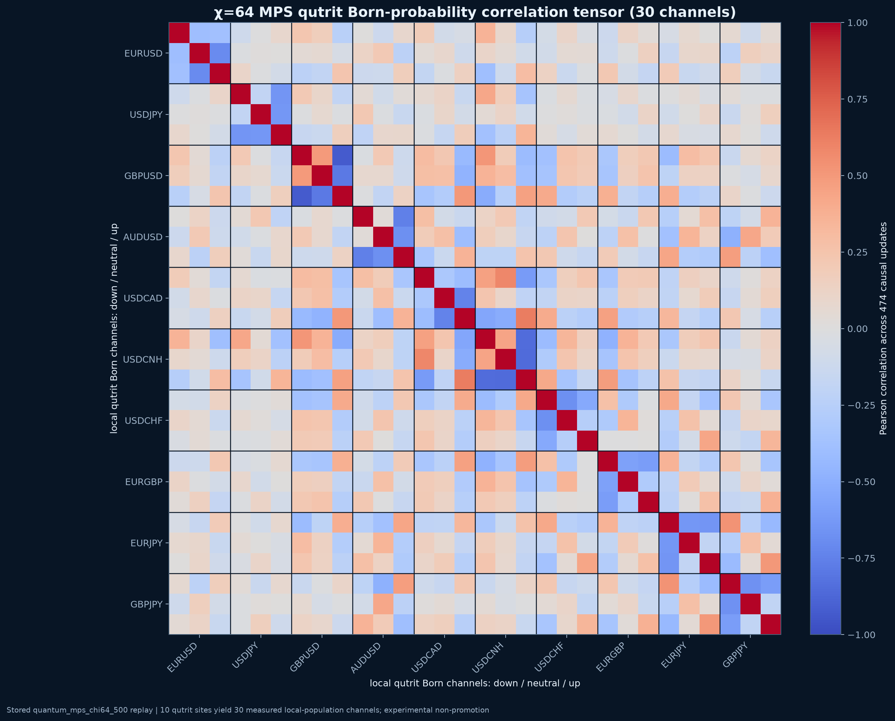
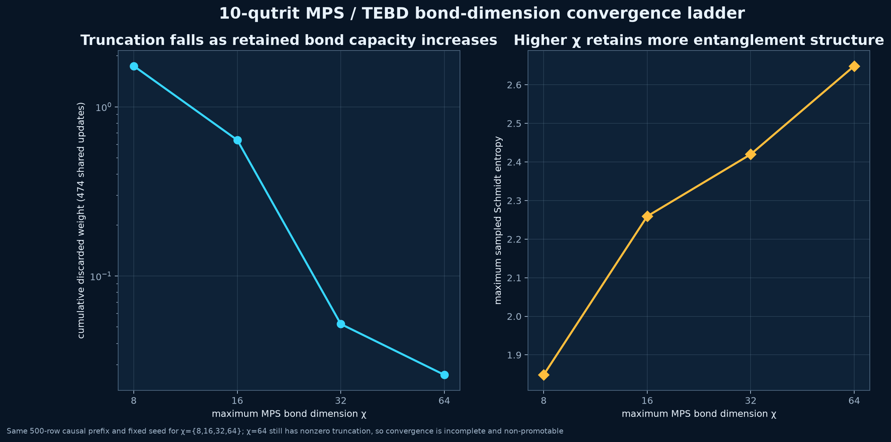

<div align="center">

# Azar · FX Dynamics Research Simulator

[](https://www.python.org/)
[](https://github.com/Aphelion-Research/Azar/actions)
[](https://aphelion-research.github.io/Azar)
[](LICENSE)
[](CONTRIBUTING.md)
[](docs/research-run-manifest.md)

**A causality-first research simulator for ten Dukascopy one-minute FX BID-bar series.**

[Quick start](#quick-start) · [Documentation](#documentation) · [Architecture](#architecture) · [Roadmap](#roadmap) · [Contributing](CONTRIBUTING.md)

</div>

> **Disclaimer:** Azar is **not a trading system**. It makes no profitability, execution, market-causation, or physical-quantum claims. It is a reproducible research platform for studying classical FX dynamics, directional coupling, and a frozen quantum-methods archive.

---

## Table of contents

- [What is Azar?](#what-is-azar)
- [Why Azar matters](#why-azar-matters)
- [System architecture](#system-architecture)
- [Repository layout](#repository-layout)
- [Quick start](#quick-start)
- [Run the full verification](#run-the-full-verification)
- [Visual gallery](#visual-gallery)
- [Documentation](#documentation)
- [Research status](#research-status)
- [Roadmap](#roadmap)
- [Key design contracts](#key-design-contracts)
- [Citation](#citation)
- [Contributing](#contributing)
- [Code of conduct](#code-of-conduct)
- [License](#license)
- [Acknowledgments](#acknowledgments)

---

## What is Azar?

Azar is a **disciplined, end-to-end research pipeline** for FX dynamics:

- **State-schema-first design** — every state update is causally grounded in observed bars.
- **Classical dynamics (active)** — causal parameter estimation, identity-aware directional coupling, and a numerically safe integrator replay.
- **Frozen quantum archive** — audited negative-results experiments using Qiskit Aer, Lindblad dynamics, reservoir computing, matrix-product states, and quantum kernels. Kept strictly separate from the classical state schema and trading path.
- **Reproducibility contracts** — pytest suite, numerical self-checks, isolated wheel smoke tests, and committed-tree verification.

### Built for researchers who care about

- Causal, leakage-free modeling
- Numerical stability and diagnostic transparency
- Clear separation between active research and archived experiments
- Verifiable, version-controlled research artifacts

---

## Why Azar matters

Most quantitative FX projects blur the line between research and execution. Azar draws a hard boundary:

| Concern | Azar's position |
|---------|-----------------|
| Profitability | Not claimed. Research-only. |
| Causality | Hard constraint at the state-schema level. |
| Look-ahead bias | Forbidden by design; CI enforces committed-tree checks. |
| Quantum advantage | Frozen negative-results archive; no unproven claims. |
| Reproducibility | Self-checks, pytest, isolated wheel smoke tests. |

---

## System architecture



Read the full architecture in [docs/ARCHITECTURE.md](docs/ARCHITECTURE.md).

---

## Repository layout

```text
engine/                 # Core simulation package
├── cli/                # auractl command-line interface
├── config/             # Tracked instrument order and schemas
├── core/               # State schema, contracts, and utilities
├── data/               # Ingestion, canonical manifest, and replay
├── evaluation/         # Holdout protocol and diagnostics
├── models/             # Classical dynamics, stat-arb, legal-event models
├── quantum/            # Frozen quantum research modules
├── tools/              # Repository verification helpers
└── visualization/      # Plotting and report generation

docs/                   # Architecture and research-contract documents
tests/                  # pytest suite and reproducibility contracts
artifacts/              # Generated figures and run summaries
data/                   # Canonical and derived data (not raw market data)
assets/                 # README gallery images
```

---

## Quick start

### Core environment (Python 3.11)

```powershell
python -m venv .venv
.venv\Scripts\python.exe -m pip install --upgrade pip
.venv\Scripts\python.exe -m pip install -r requirements-core.txt
.venv\Scripts\python.exe -m pip install -e .
```

### Quantum environment (optional, frozen archive)

```powershell
python -m venv .venv-quantum
.venv-quantum\Scripts\python.exe -m pip install -r requirements-quantum.txt
```

### CLI smoke test

```powershell
auractl --help
```

---

## Run the full verification

```powershell
python -m pytest tests -q
python -m engine.models.classical.simulate_integrator --self-check
python -m engine.models.statistical.stat_arb --self-check
python -m engine.models.events.legal_event --self-check
python -m engine.quantum.quantum_lindblad --self-check
python -m engine.quantum.quantum_reservoir --self-check
.venv-quantum\Scripts\python.exe -m engine.quantum.quantum_aer_noise --self-check
```

### Installed-package smoke test

```powershell
python -m build --wheel
python -m pip install dist\<wheel>
auractl --help
auractl stat-arb --self-check
```

There are no execution data and no profitability claim. Quantum modules remain a frozen negative-result research archive, outside the core dependency set.

---

## Visual gallery

Selected diagnostics from the frozen research archive and classical coupling analysis.

### Lindblad qutrit state plane


### Reservoir observable correlation


### Aer synthetic noise heatmap


### Causal coupling field


### MPS qutrit correlation tensor


### MPS bond dimension ladder


---

## Documentation

| Document | Purpose |
|----------|---------|
| [docs/ARCHITECTURE.md](docs/ARCHITECTURE.md) | High-level system architecture and module responsibilities |
| [docs/ROADMAP.md](docs/ROADMAP.md) | Planned evolution and research milestones |
| [docs/API.md](docs/API.md) | Public API, CLI, and self-check entry points |
| [docs/FAQ.md](docs/FAQ.md) | Frequently asked questions |
| [docs/state-schema.md](docs/state-schema.md) | Source-of-truth state vector and open questions |
| [docs/dynamics.md](docs/dynamics.md) | Causal parameter definitions and equations of motion |
| [docs/coupling.md](docs/coupling.md) | Directional coupling, identity controls, and stability |
| [docs/integrator.md](docs/integrator.md) | Replay, checkpointing, gap handling, and numerical safety |
| [docs/datapipe.md](docs/datapipe.md) | Raw-bar ingestion and feature pipeline |
| [docs/stat-arb.md](docs/stat-arb.md) | Frozen residual-level research contract and OQ-14 gate |
| [docs/legal-event.md](docs/legal-event.md) | Legal-event lineage and causal-study contract |
| [docs/evaluation-protocol.md](docs/evaluation-protocol.md) | Holdout, promotion, and statistical-confidence rules |
| [docs/quantum-redteam.md](docs/quantum-redteam.md) | Frozen quantum experiment findings |
| [docs/research-run-manifest.md](docs/research-run-manifest.md) | Run manifest and evidence requirements |
| [docs/repository-verification.md](docs/repository-verification.md) | Committed-tree audit and CI requirements |

---

## Research status

- **Active (classical):** causal parameter estimation, directional coupling diagnostics, and integrator replay.
- **Frozen (v0.2):** residual-level statistical arbitrage and all quantum modules. They remain as audited negative-results archives until new post-2024 data and a fresh predeclared split are available.
- **No promotion without out-of-sample evidence.** In-sample scores or numerical invariants do not promote a model. Promotion requires a predeclared target, matched classical comparators, untouched chronological folds, leakage/placebo checks, statistical confidence, and execution-quality data.

---

## Roadmap

High-level plan. See [docs/ROADMAP.md](docs/ROADMAP.md) for full details.

- **Q3 2026:** stabilize classical integrator, complete GitHub Pages docs, add benchmark harness.
- **Q4 2026:** ingest first post-2024 holdout split, run OQ-14 gate, publish evaluation run manifest.
- **2027:** expand instrument coverage, investigate regime-change detection, release v1.0 classical API.

---

## Key design contracts

- `engine/config/instruments.json` is the tracked, load-bearing instrument order.
- Ingestion writes that order into `data/canonical/manifest.json`; generated manifests must validate against the tracked configuration.
- A state update requires an observed contiguous 60-second predecessor.
- The first bar after a gap resets state and EWMA; it may not form a return from the prior session.
- Parameters and coupling are zero-order-held only from timestamps at or before the current bar.
- Directional coupling needs more than spectral radius: the integrator logs largest singular value, transient power growth, eigenvector conditioning, and a unit-circle pseudospectral sensitivity estimate.

---

## Citation

If you use Azar in academic work, please cite:

```bibtex
@software{azar2026,
  title = {Azar: FX Dynamics Research Simulator},
  author = {Aphelion Research},
  year = {2026},
  url = {https://github.com/Aphelion-Research/Azar},
  note = {Research simulator; not a trading system}
}
```

---

## Contributing

See [CONTRIBUTING.md](CONTRIBUTING.md). All changes must pass the pytest suite and the committed-tree verification before being merged.

Please read our [Code of Conduct](CODE_OF_CONDUCT.md) before participating.

---

## Code of conduct

This project follows the [Contributor Covenant Code of Conduct](CODE_OF_CONDUCT.md).

---

## License

Azar is released under the [MIT License](LICENSE). Use it for research and education only; it is not a trading product and carries no performance warranty.

---

## Acknowledgments

- Dukascopy for the publicly available one-minute FX bar format used in research design.
- The Qiskit community for open-source quantum simulation tools used in the frozen archive.
- Contributors and reviewers who keep Azar causality-safe and reproducible.
