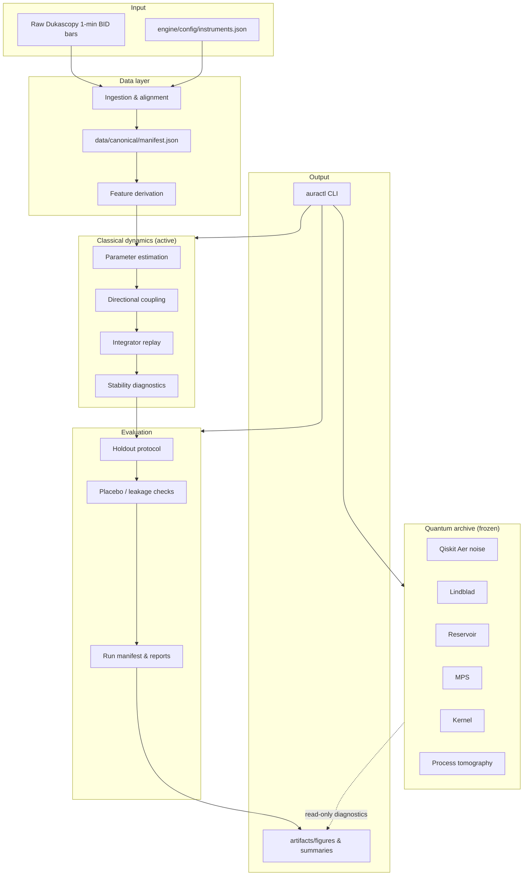
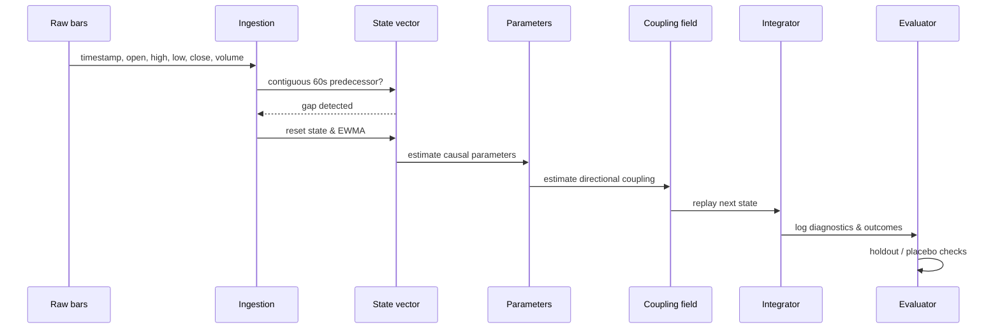

# Architecture

This document describes the high-level architecture of Azar. It is intended for contributors, reviewers, and anyone extending the simulator.

## Design principles

1. **Causality first.** Every state update must be grounded in an observed predecessor. No future information may leak into the present state.
2. **Schema-first.** The canonical state vector is the source of truth. Models consume and produce state vectors, not ad-hoc arrays.
3. **Separation of concerns.** Classical dynamics, evaluation, and the frozen quantum archive are independent modules. Quantum code cannot change classical state, parameters, or decisions.
4. **Reproducibility by default.** CI, self-checks, committed-tree verification, and isolated wheel smoke tests guard every change.
5. **No trading claims.** Azar is a research simulator; it does not execute orders or promise profitability.

## System overview

## Module responsibilities

| Module | Path | Responsibility |
|--------|------|----------------|
| CLI | `engine/cli/` | `auractl` entry point and command dispatch |
| Config | `engine/config/` | Tracked instrument order and JSON schemas |
| Core | `engine/core/` | State schema, contracts, validation, and utilities |
| Data | `engine/data/` | Ingestion, canonical manifest, replay helpers |
| Evaluation | `engine/evaluation/` | Holdout protocol, diagnostics, and run manifest |
| Classical models | `engine/models/classical/` | Single-particle dynamics and integrator |
| Statistical models | `engine/models/statistical/` | Frozen residual-level research |
| Event models | `engine/models/events/` | Legal-event lineage and causal studies |
| Quantum | `engine/quantum/` | Frozen negative-results experiments |
| Tools | `engine/tools/` | Repository verification and audit helpers |
| Visualization | `engine/visualization/` | Plotting and report generation |

## State flow

## Security and isolation boundaries

- The quantum archive is read-only with respect to classical state. It may read derived artifacts for diagnostics, but never writes to `engine/core/state` or `engine/models/classical`.
- `engine/config/instruments.json` is load-bearing and tracked. Generated manifests validate against it.
- CI runs from a clean checkout; no generated data or secrets are committed.

## Extension points

1. **New classical model:** implement a state-update function that accepts and returns the canonical state vector, then add a self-check.
2. **New evaluation metric:** add a module under `engine/evaluation/` and wire it into the run manifest.
3. **New quantum experiment:** add a frozen module under `engine/quantum/` with a `--self-check` entry point; it must not modify classical modules.
